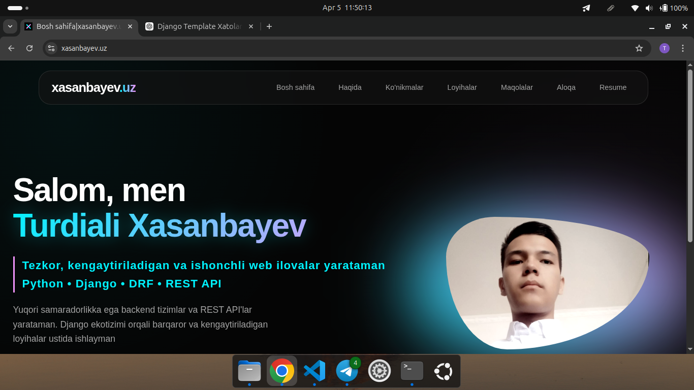

# 🌐 xasanbayev.uz

Personal portfolio and blog website built with Django.
This project showcases my work, skills, and articles in a modern UI.

---

## 🚀 Features

* 🧑‍💻 Personal portfolio (About, Skills, Resume)
* 📝 Blog system (articles with detail pages)
* 📬 Contact form (Django messages integration)
* ⚡ Clean and modern UI (custom CSS, animations)
* 📱 Fully responsive design
* 🔐 Secure backend with Django

---

## 🛠️ Tech Stack

* **Backend:** Django
* **Frontend:** HTML, CSS, JavaScript
* **Database:** SQLite (default)
* **Styling:** Custom CSS (Glassmorphism + Neon UI)
* **Icons:** Font Awesome

---

## 📂 Project Structure

```
xasanbayev/
│── config/              # Main Django settings
│── apps/
│   ├── contact/           # Contact page
│   ├── article/           # Blog system
│   └── portfolio/         # Portfolio system (about, skills, projects. etc)
│
│── templates/          # HTML templates
│── static/             # CSS, JS, images
│── scripts/            # .sh (script files)
│── media/              # Uploaded files
│── manage.py
```

---

## ⚙️ Installation

### 1. Clone repository

```bash
git clone https://github.com/turdialixasanbayev/xasanbayev.git
cd xasanbayev
```

### 2. Virtual environment

```bash
python -m venv venv
source venv/bin/activate   # Linux / Mac
venv\Scripts\activate      # Windows
```

### 3. Install dependencies

```bash
pip install -r requirements.txt
```

### 4. Migrate database

```bash
python manage.py migrate
```

### 5. Run server

```bash
python manage.py runserver
```

---

## 🔑 Environment Variables

Create `.env` file:

```
SECRET_KEY=your_secret_key
DEBUG=your_debug
ALLOWED_HOSTS=your_allowed_hosts
CSRF_TRUSTED_ORIGINS=your_csrf_trusted_origins
DATABASE_URL=your_database_url
```

---

## 📬 Contact

* Email: [xasanbayevturdiali92@gmail.com](gmail:xasanbayevturdiali92@gmail.com)
* Telegram: @turdialixasanbayev

---

## 📸 Screenshots



---

## 📄 License

This project is open-source and available under the MIT License.

---

## 💡 Author

**Turdiali Xasanbayev**
Python Developer

---

⭐ If you like this project, give it a star!
